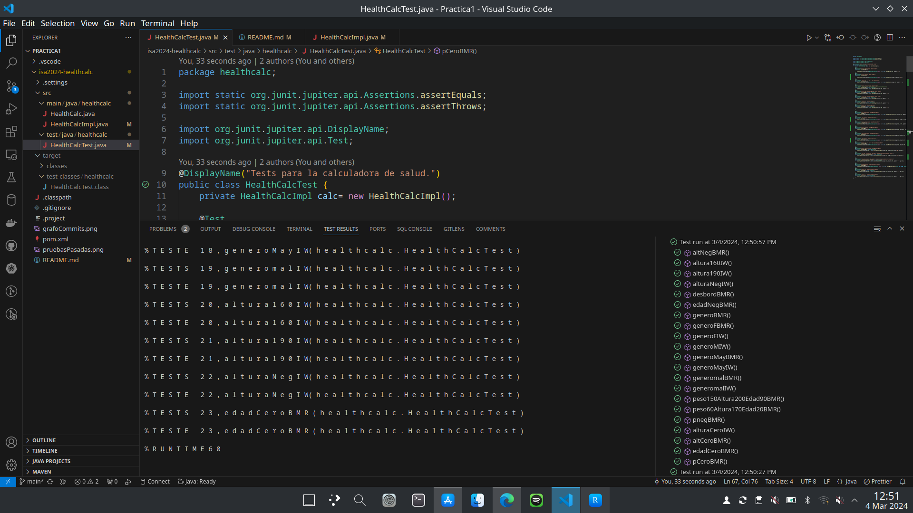

# isa2024-healtcalc
Health calculator
***
# Practica 2

## Imagen del diagrama de casos de uso

***
## Especificacion de casos de uso
### Calculate IMB
##### Primary Actor: Usuario de la aplicacion
##### Scope: Health calculator
##### Level: Summary

##### Stakeholders and Interests:
- El usuario - que quiere calcular su indice de masa corporal
- El profesional de la salud - que quiere hacer un seguimiento al paciente

##### Precondition:El usuario ha iniciado la aplicacion

##### Minimal guarantees: Los datos del paciente son tratados segun la ley de proteccion de datos

##### Success guarantees: El usuario obtendra su indice de masa corporal según sus medidas

##### Trigger: El usuario selecciona "Calculate IMB" en la calculadora

##### Main success scenario:
1. El sistema pide masa y altura en un formulario
2. El usuario rellena el formulario con los datos
3. El usuario envia los datos pulsando el boton enviar
4. El sistema imprime por pantalla IMB

##### Alternatice scenario:
- 1a.El usuario introduce mal los datos:
- 1a1.El sistema muestra un mensaje de error

##### Extensions:
- 1a. El usuario pulsa el boton volver:
- 1a1.El sistema carga la pagina de inicio de la calculadora

***
# Practica 1
# Pruebas unitarias
## Clase HealthCalImp
---
### Metodo idealWeight

#### Pruebas de particion (se compureba todos los tipos de entrada y salida posibles)
- Altura menor
- Altura cero
- Podriamos comprobar una altura minima pero no esta implementado
- Genero ni 'm' ni 'f'
- Genero en mayusculas
- Altura 160 (valor bajo)
- Altura 190 (valor alto)
- Prueba de desbordamiento no necesaria ya que no ocurre nunca 
- No se comprueban salidas negativas ya que segun la formula es posible si la altura es baja pero no tiene sentido(hablar con el cliente)

#### Pruebas de caminos base (se comprueba todos los caminos o posiblidades de un metodo)
Tenemos dos caminos, hombre y mujer.

- Genero 'm'
- Genero 'f'
***
### Metodo basalMetabolicRate

#### Pruebas de particion (se compureba todos los tipos de entrada y salida posibles)
- Peso negativo
- Peso cero
- Altura negativa
- Altura cero
- Edad negativa
- Edad cero
- Se podrian comprobar peso altura minimas
- Genero ni 'm' ni 'f'
- Genero en mayusculas
- Peso 60, altura 170, edad 20 en basalMetabolicRate(valores bajos)
- Peso 150, altura 200, edad 90 en basalMetabolicRate(valores altos)
- Prueba de desbordamiento (por el tipo de metodo no se deberia de llegar nunca pero lo añado para recordar que es importante este tipo de prueba)
- No se comprueban salidas negativas ya que segun la formula es posible si la altura es baja pero no tiene sentido(hablar con el cliente)

#### Pruebas de caminos base (se comprueba todos los caminos o posiblidades de un metodo)
Tenemos dos caminos, hombre y mujer.

- Genero 'm'
- Genero 'f'

## Imagen con las pruebas pasadas

## Imagen con el grafo de commits

