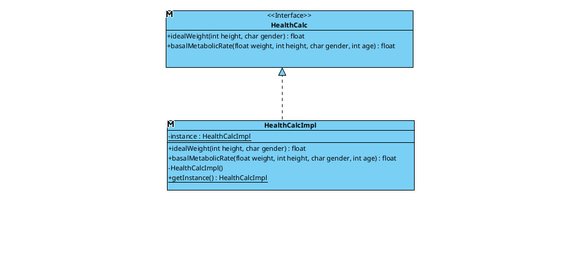

# isa2024-healtcalc
Health calculator
***

# Práctica 7: Refactorings
## Refactoring 1
Bad smell: Large class /Sympthom: too many resoibsibility /Violacion del principio de segregación de interfaces

Extract Class: dividimos la interfaz calculadora en dos interfaces, una para cada operación

Tipo:class refactoring

Descripcion: Ahora, calculadoraSalud tendra un objeto CardiovascularMtreics y otro MetabolicMetrics

Cambios:2 clases nuevas, dos interfaces, cambios en dos metodos de HealthCalcImp, añadidos atributos en esta. Total:8

## Refactoring 2
Bad smelling: diferencias entre tipos numericos

Cambio de tipo de salida en los calculos a double

Tipo: method refactoring

Descripcion: Cambiaremos el tipo de salida a double para unificarlos.

Cambios:2 metodos, 2 metodos en HealthCalcImp y los returns de HealthCalc. Returns del proxy y hacer cast en adapter. cambiar tipo de las variables resultado del controlador a double.(Importante no cambiar la interfaz HealthHospital porque no es nuestra). Total:12

## Refactoring 3
Problema: Se usa caracter como genero

Solución: creamos un tipo enumerate que contenga sexo masculino y femenino.

Tipo: attribute refactoring

Descripcion: Pasaremos como parametro a la calculadora el sexo en forma de enumerado

Cambios: Crear un enumerate, 2 parametros de metodos en interfaces, las implementacines de estas. Parametros de calculadora y su interfaz. Cambiado proxy y healthstats. vista controlador y test cambiados. Total:13

## Refactoring 4
Bad smelling:metodo muy grande,con muchos parametros de entrada / LONG PARAMETER LIST /grupos cohesionados pueden constituir clases independientes / Data Clumps-Data that are always used together

Introduce Parameter Object

Tipo: class refactoring

Descripcion: Crearemos la clase persona, que será pasada a la calculadora, en vez de una larga lista de atributos de esta.persona tendra dos constructores, uno para cada tipo de calculo.

Cambios: Crear clase persona e implementacion. Cambiar metodos e interfaces de los metrics.Cambiamos interfaz y clase calculadora. Proxy,adapter,controlador y test. Total:14

# Práctica 6: Patrones de diseño
En esta practica, hemos implementado patrones de diseño para realizar tareas especificas como adaptar nuestra calculadora a las especificaciones de un hopital, llevar un registro y sacar estadisticas de los datos con proxy o traducir nuestra calculadora a distintos idiomas y sistemas metricos con decoradores.

## Singleton
Implementamos singleton para solo tener una calculadora en todo el programa.

## Adapter
Adaptamos nuestra calculadora a la interfaz suministrada por el **Hospital Costa Del Sol De Marbella** que usa altura en metros u peso en gramos.

## Proxy
También nos han pedido que se lleve un registro de las veces que se utiliza la 
calculadora en su sistema informático, almacenando los datos de los pacientes de 
forma anónima, y permitiendo obtener la media de los valores introducidos y 
calculados por la calculadora de todos los pacientes. Para ello, nos han dado la interfaz HealthStats.

Diseñamos una solución con el patron Proxy, que redirigirá los datos a una clase Singleton de estadistica, que los almacenará y calculará medidas.

## Decorator
Por último, queremos implementar distintas formas de visualizar los resultados. Se quiere tener diferentes idiomas y unidades de medidas, podiendolos mezclar a gusto del cliente. Para esto aplicaremos el patron decorador, los distintos decoradores(unidades europeas,unidades americanas, ingles, español) envolverán el objeto HealthHospital, confiriendole de flexibilidad y variavilidad en runtime.

# Práctica 4: Interfaz gráfica de usuario
En esta practica, hemos desarrollado una interfaz grafica con swim y apoyado de window builder
## Boceto

## Diseño final

La interfaz grafica esta diseñada para solo admitir el tipo de numero correspondiente a cada campo.
Utilizando Tab se puede navegar por los campos:
- para seleccionar sexo sin ratón, navegar hasta el y pulsar la barra espaciadora.
- para cambiar el metodo, navegar hasta el campo y seleccionar con flehas hacia arriba o abajo.
# Pruebas unitarias
## Clase HealthCalImp
---
### Metodo idealWeight

#### Pruebas de particion (se compureba todos los tipos de entrada y salida posibles)
- Altura menor
- Altura cero
- Podriamos comprobar una altura minima pero no esta implementado
- Genero ni 'm' ni 'f'
- Genero en mayusculas
- Altura 160 (valor bajo)
- Altura 190 (valor alto)
- Prueba de desbordamiento no necesaria ya que no ocurre nunca 
- No se comprueban salidas negativas ya que segun la formula es posible si la altura es baja pero no tiene sentido(hablar con el cliente)

#### Pruebas de caminos base (se comprueba todos los caminos o posiblidades de un metodo)
Tenemos dos caminos, hombre y mujer.

- Genero 'm'
- Genero 'f'
***
### Metodo basalMetabolicRate

#### Pruebas de particion (se compureba todos los tipos de entrada y salida posibles)
- Peso negativo
- Peso cero
- Altura negativa
- Altura cero
- Edad negativa
- Edad cero
- Se podrian comprobar peso altura minimas
- Genero ni 'm' ni 'f'
- Genero en mayusculas
- Peso 60, altura 170, edad 20 en basalMetabolicRate(valores bajos)
- Peso 150, altura 200, edad 90 en basalMetabolicRate(valores altos)
- Prueba de desbordamiento (por el tipo de metodo no se deberia de llegar nunca pero lo añado para recordar que es importante este tipo de prueba)
- No se comprueban salidas negativas ya que segun la formula es posible si la altura es baja pero no tiene sentido(hablar con el cliente)

#### Pruebas de caminos base (se comprueba todos los caminos o posiblidades de un metodo)
Tenemos dos caminos, hombre y mujer.

- Genero 'm'
- Genero 'f'

## Imagen con las pruebas pasadas

## Imagen con el grafo de commits

